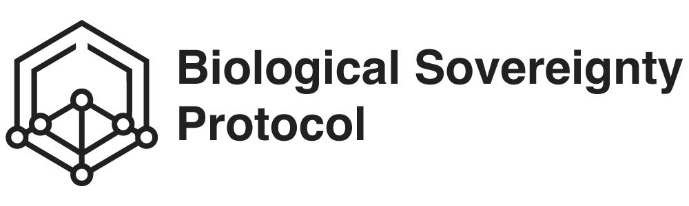

  

  <h3>The central community, governance, and standards hub for the BSP ecosystem.</h3>

---

# Biological Sovereignty Protocol (`.github`)

Welcome to the central command for the **Biological Sovereignty Protocol (BSP)** open-source organization.

This repository (`.github`) is a special repository utilized by GitHub to store default community health files, issue templates, and the organization-wide profile. The guidelines established here apply universally across all BSP ecosystem repositories unless explicitly overridden.

## 🌟 Our Mission

To empower individuals with absolute cryptographic ownership over their biological data, enabling a decentralized, zero-trust foundation for the future of longevity research and precision medicine.

By unifying health data through **Biological Entity Objects (BEOs)** and **SmartWeave Contracts**, we replace fragmented institutional silos with a single, sovereign source of truth.

---

## 🏛️ Community Standards & Governance

The files in this repository dictate how the BSP community operates, collaborates, and maintains security.

| Document | Purpose |
| :--- | :--- |
| 🛡️ [**SECURITY.md**](./SECURITY.md) | **Critical:** Outline of our vulnerability disclosure policy. Covers SmartWeave exploits, Shamir Secret leaks, and Ed25519 signature validation. |
| 🤝 [**CONTRIBUTING.md**](./CONTRIBUTING.md) | The architectural philosophy and step-by-step guide for contributing to our SmartWeave contracts, SDKs, and APIs. |
| ⚖️ [**CODE_OF_CONDUCT.md**](./CODE_OF_CONDUCT.md) | The standard rules of interaction to ensure a safe, welcoming, and professional environment for researchers and developers. |
| 📝 [**Issue Templates**](./ISSUE_TEMPLATE/) | Standardized templates ensuring contributors map bugs and feature requests to specific components in our stack. |
| 🗣️ [**Discussion Templates**](./DISCUSSION_TEMPLATE/) | Categorized forums for debating Protocol Specification, SDK Usage, and BEO/IEO Architecture. |

### The Organization Profile

The landing page shown when anyone visits [github.com/Biological-Sovereignty-Protocol](https://github.com/Biological-Sovereignty-Protocol) is powered by the `profile/README.md` file within this repository. It showcases our core architecture and ecosystem repositories to new visitors.

---

## 🚀 The BSP Ecosystem

While this repository holds the standards, the actual protocol implementation is distributed across several key repositories:

### 1. Core Implementations (This GitHub Org)
- 📦 **[@bsp/sdk](https://github.com/Biological-Sovereignty-Protocol/bsp-sdk-typescript)**: The official TypeScript SDK.
- 📦 **[@bsp/python-sdk](https://github.com/Biological-Sovereignty-Protocol/bsp-sdk-python)**: The official Python SDK for data science and AI.
- ⚡ **[bsp-mcp](https://github.com/Biological-Sovereignty-Protocol/bsp-mcp)**: Model Context Protocol (MCP) server for native AI Assistant integration.

### 2. Protocol Contracts (Ambrosio Institute Org)
*The immutable SmartWeave infrastructure is stewarded by the [Ambrosio Institute](https://github.com/Ambrosio-Institute).*
- 📜 **[bsp-registry](https://github.com/Ambrosio-Institute/bsp-registry)**: The SmartWeave contracts (`BEORegistry`, `IEORegistry`, `AccessControl`).
- 🚂 **[bsp-registry-api](https://github.com/Ambrosio-Institute/bsp-registry-api)**: The official protocol relayer service for gas abstraction.

---

## 💡 How to update these files

If you want to propose a change to the community standards (for example, updating a bug report template or refining the Code of Conduct):

1. Fork this `.github` repository.
2. Make your modifications.
3. Submit a Pull Request against the `main` branch.
4. Once merged, the changes will immediately reflect across the entire Biological Sovereignty Protocol organization.

 

  
  
  

